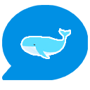
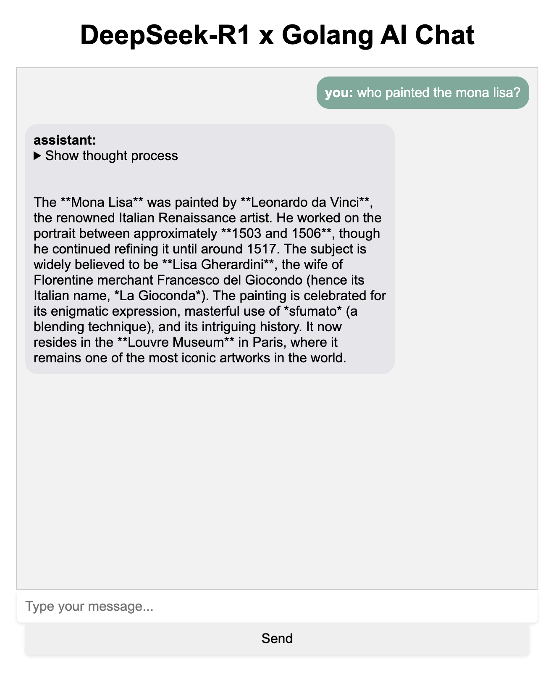
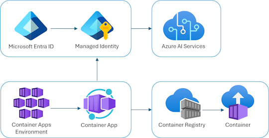

<!-- prettier-ignore -->
<div align="center">

 


# DeepSeek-R1 Go Starter

[](https://codespaces.new/Azure-Samples/deepseek-go)


This sample demonstrates how to build a web chat application using Go that integrates with DeepSeek-R1 model hosted in Azure AI Foundry. The application provides a web interface for interacting with the model, deployed securely using Azure Container Registry (ACR) and Azure Container Apps.

:star: If you like this sample, star it on GitHub — it helps a lot!

</div>

## Important Security Notice
This template, the application code and configuration it contains, has been built to showcase Microsoft Azure specific services and tools. We strongly advise our customers not to make this code part of their production environments without implementing or enabling additional security features. See Security Guidelines for more information on how to secure your deployment.

## Technology Stack

- **Application base language**: Go (1.24+)
- **Authentication**: Microsoft Entra ID (formerly Azure AD)
- **API Integration**: Azure AI Foundry Services with DeepSeek-R1 model
- **Infrastructure**: 
  - Azure Container Apps for hosting
  - Azure Container Registry for image storage
  - Azure AI Services for DeepSeek-R1 model deployment
  - Azure Log Analytics for monitoring
  - Quick deployment with the azd CLI (approximately 5 minutes)
- **IaC**: Bicep for infrastructure deployment
- **Web Interface**: HTML/CSS with vanilla JavaScript





## Key Components

### Go Application Structure

The application follows a simple, maintainable structure:
- HTTP server with dedicated endpoints for chat and health monitoring
- Service-based architecture with handler pattern
- Token-based authentication for Azure AI Services
- Concurrency control with mutex to prevent API flooding

### Infrastructure Design

The project uses Azure Bicep for infrastructure deployment, with key components:
- Azure Container Registry for image management
- Azure Container Apps for containerized application hosting
- Azure AI Services for DeepSeek-R1 model deployment
- Microsoft Entra ID integration for authentication
- Azure Log Analytics for monitoring and diagnostics

### Security Features

- Microsoft Entra ID application registration for authentication
- Token-based access to Azure AI Services
- Concurrency control to prevent API abuse
- Configurable rate limiting

## Getting Started

### GitHub Codespaces Development

This repository is configured for immediate development in GitHub Codespaces:

1. Click the "Open in GitHub Codespaces" button at the top of this README
2. Wait for the devcontainer to build and initialize
3. Copy `.env.example` to `.env` and update with your Azure credentials
4. Run the application with `go run src/main.go`

The application will be available on port 3000, which is automatically forwarded by Codespaces.

## Deploying

Once you've opened the project in [Codespaces](#github-codespaces), in [Dev Containers](#vs-code-dev-containers), or [locally](#local-environment), you can deploy it to Azure.

### Azure account setup

1. Sign up for a [free Azure account](https://azure.microsoft.com/free/) and create an Azure Subscription.
2. Request access to Azure OpenAI Service by completing the form at [https://aka.ms/oai/access](https://aka.ms/oai/access) and awaiting approval.
3. Check that you have the necessary permissions:

    * Your Azure account must have `Microsoft.Authorization/roleAssignments/write` permissions, such as [Role Based Access Control Administrator](https://learn.microsoft.com/azure/role-based-access-control/built-in-roles#role-based-access-control-administrator-preview), [User Access Administrator](https://learn.microsoft.com/azure/role-based-access-control/built-in-roles#user-access-administrator), or [Owner](https://learn.microsoft.com/azure/role-based-access-control/built-in-roles#owner). If you don't have subscription-level permissions, you must be granted [RBAC](https://learn.microsoft.com/azure/role-based-access-control/built-in-roles#role-based-access-control-administrator-preview) for an existing resource group and [deploy to that existing group](/docs/deploy_existing.md#resource-group).
    * Your Azure account also needs `Microsoft.Resources/deployments/write` permissions on the subscription level.

### Deploying with azd

1. Login to Azure:

    ```shell
    azd auth login
    ```

2. Provision and deploy all the resources:

    ```shell
    azd up
    ```

    It will prompt you to provide an `azd` environment name (like "chat-app"), select a subscription from your Azure account, and select a [location where DeepSeek-R1 is available](https://learn.microsoft.com/azure/ai-studio/how-to/deploy-models-serverless-availability#deepseek-models-from-microsoft) (like "westus"). Then it will provision the resources in your account and deploy the latest code. If you get an error or timeout with deployment, changing the location can help, as there may be availability constraints for the Azure AI resource.

3. When `azd` has finished deploying, you'll see an endpoint URI in the command output. Visit that URI, and you should see the chat app! 🎉
4. Remember to take down your app once you're no longer using it, either by deleting the resource group in the Portal or running this command:

    ```shell
    azd down --purge
    ```

### Prerequisites

- Go v1.24 or later
- Docker
- Azure Developer CLI (azd) v1.13 or later _(support for docker as a language in the `azure.yaml` is required)_
- Azure subscription with permissions to create resources

### Local Development

1. Clone the repository:
   ```bash
   git clone https://github.com/Azure-Samples/deepseek-go
   cd deepseek-go
   cd src
   ```

2. Create a `.env` file inside the `src` directory with required configuration:

   > 📝 You can copy the `.env.example` file and fill in your values.
_To acquire the following values, after using azd to deploy the application, run the following command in your terminal: `azd env get-values | grep "AZURE_INFERENCE_ENDPOINT" && azd env get-values | grep "AZURE_TENANT_ID"`_

   ```
   AZURE_TENANT_ID=<your-tenant-id>
   AZURE_INFERENCE_ENDPOINT=<your-azure-ai-endpoint>
   AZURE_DEEPSEEK_DEPLOYMENT=DeepSeek-R1
   ```
   > ⚠️ Never commit your `.env` file to source control. It's already in `.gitignore`.

3. Install dependencies:
   ```bash
   go mod download
   ```

4. Run the application:
   ```bash
   go run main.go
   ```

### Running Tests

To run the tests in `main_test.go`, ensure you are in the `src` directory and run the following command(s):

```bash
go test ./... -v
```

This will execute all the test cases and display detailed output for each test.

### Docker Development

Build and run the application using Docker:

```bash
docker build -t deepseek-go -f src/Dockerfile .
docker run -p 3000:3000 --env-file .env deepseek-go
```

## Project Structure

```
├── src/                 # Application source code
│   ├── main.go          # Main application entry point
│   ├── Dockerfile       # Container configuration
│   └── static/          # Web interface assets
│       ├── index.html   # Chat UI
│       └── styles.css   # Styling
├── infra/               # Infrastructure as code
│   ├── main.bicep       # Main infrastructure template
│   ├── aca.bicep        # Container App configuration
│   └── core/            # Core infrastructure components
└── docs/                # Documentation and images
```

## Configuration

The application uses environment variables for configuration:

- `AZURE_TENANT_ID`: Your Azure tenant ID for authentication
- `AZURE_INFERENCE_ENDPOINT`: The endpoint for Azure AI Services
- `AZURE_DEEPSEEK_DEPLOYMENT`: The model deployment name (defaults to "DeepSeek-R1")
- `RUNNING_IN_PRODUCTION`: Set to "true" when running in Azure to use managed identity
- `AZURE_CLIENT_ID`: The client ID for managed identity in production

## Guidance

### Costs

Pricing varies per region and usage, so it isn't possible to predict exact costs for your usage.
The majority of the Azure resources used in this infrastructure are on usage-based pricing tiers.
However, Azure Container Registry has a fixed cost per registry per day.

You can try the [Azure pricing calculator](https://azure.microsoft.com/pricing/calculator/) for the resources:

* Azure AI Service: S0 tier, DeepSeek-RW model. Pricing is based on token count. [Pricing]()
* Azure Container App: Consumption tier with 0.5 CPU, 1GiB memory/storage. Pricing is based on resource allocation, and each month allows for a certain amount of free usage. [Pricing](https://azure.microsoft.com/pricing/details/container-apps/)
* Azure Container Registry: Basic tier. [Pricing](https://azure.microsoft.com/pricing/details/container-registry/)
* Log analytics: Pay-as-you-go tier. Costs based on data ingested. [Pricing](https://azure.microsoft.com/pricing/details/monitor/)

⚠️ To avoid unnecessary costs, remember to take down your app if it's no longer in use,
either by deleting the resource group in the Portal or running `azd down`.

### Security Guidelines

This template uses [Managed Identity](https://learn.microsoft.com/entra/identity/managed-identities-azure-resources/overview) for authenticating to the Azure OpenAI service.

This template also enables the Container Apps [built-in authentication feature](https://learn.microsoft.com/azure/container-apps/authentication) with a Microsoft Entra ID identity provider. The Bicep files use the new [Microsoft Graph extension (public preview)](https://learn.microsoft.com/graph/templates/overview-bicep-templates-for-graph) to create the Entra application registration using [managed identity with Federated Identity Credentials](https://learn.microsoft.com/azure/container-apps/managed-identity), so that no client secrets or certificates are necessary.

Additionally, we have added a [GitHub Action](https://github.com/microsoft/security-devops-action) that scans the infrastructure-as-code files and generates a report containing any detected issues. To ensure continued best practices in your own repository, we recommend that anyone creating solutions based on our templates ensure that the [Github secret scanning](https://docs.github.com/code-security/secret-scanning/about-secret-scanning) setting is enabled.

You may want to consider additional security measures, such as:

* Protecting the Azure Container Apps instance with a [firewall](https://learn.microsoft.com/azure/container-apps/waf-app-gateway) and/or [Virtual Network](https://learn.microsoft.com/azure/container-apps/networking?tabs=workload-profiles-env%2Cazure-cli).
* Enabling Microsoft Defender for Cloud on the resource group and setting up [security policies](https://learn.microsoft.com/azure/defender-for-cloud/security-policy-concept).

## Contributing

Contributions are welcome! Please feel free to submit a Pull Request. For major changes, please open an issue first to discuss what you would like to change.

## License

This project is licensed under the MIT License - see the LICENSE file for details.
